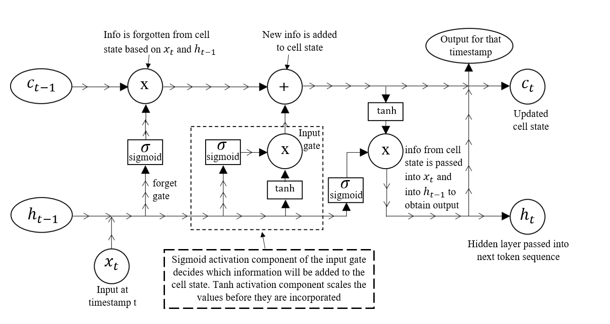
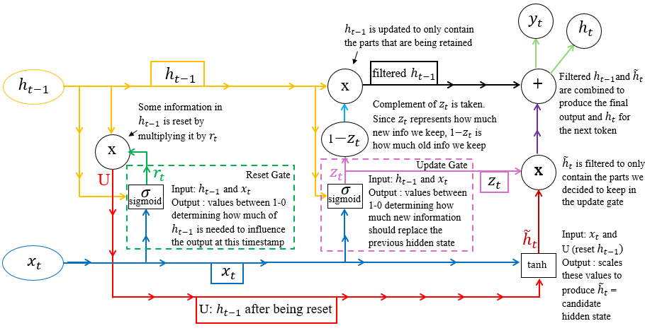
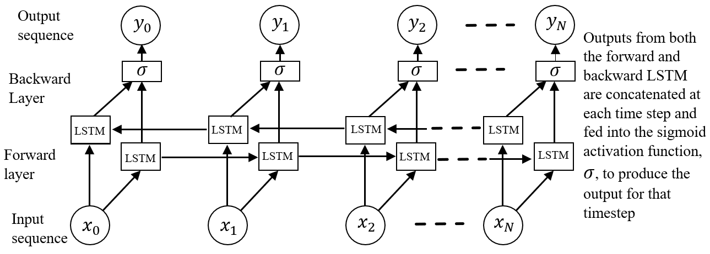
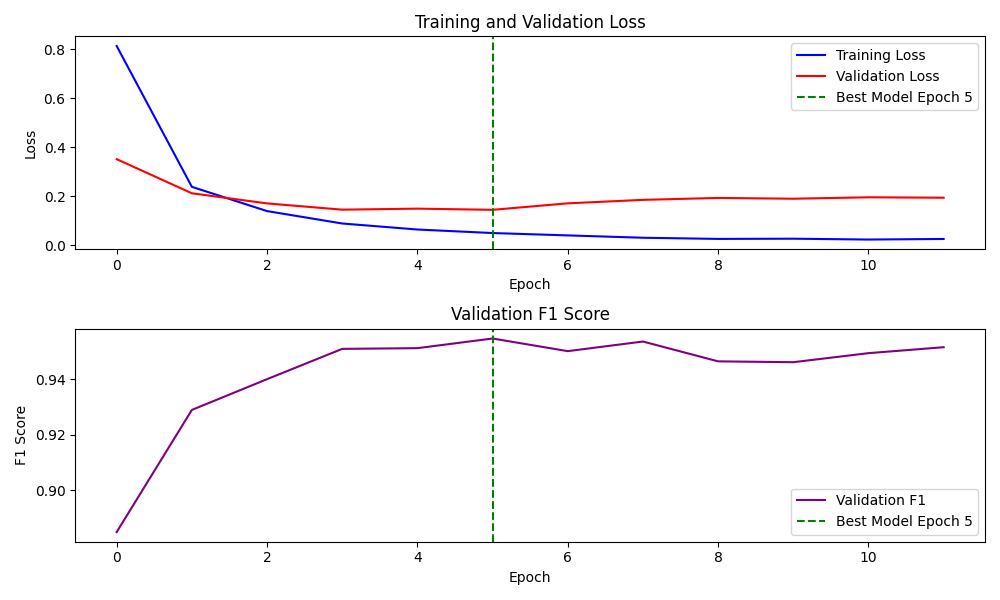

# Slot Tagging with CNN vs RNN Variants

**Darian Lee**  
UC Santa Cruz  
Sunnyvale, CA, 94087  
[daeilee@ucsc.edu](mailto:daeilee@ucsc.edu)

---

## Abstract
This paper examines the strengths and weaknesses of various models for slot tagging of film-related utterances. I compare LSTM and GRU variants to CNNs. I find that the best model for this task is a standard CNN with no dilated layers. The final model consists of three convolutional layers with a kernel size of 3. The ReLU activation function was used to introduce non-linearity, and a dropout rate of 0.4 was applied to prevent overfitting. The model achieved a final testing macro F1 score of 0.78. I believe obtaining a significantly higher macro F1 on this dataset is unlikely due to noisy labels and insufficient training data for certain classes.

## Introduction
The goal of this project was to develop a model for slot tagging movie-related queries using IOB tagging. IOB tagging is a technique used to identify key information in an utterance by labeling each word in a sequence as either `O` (indicating the word is "outside" of an important phrase, i.e., irrelevant), `B_class` (indicating the word marks the beginning of an important phrase related to a specific class, e.g., `B_movie` for the start of a movie title), or `I_class` (indicating the word is inside an important phrase related to that class). Slot tagging is a crucial intermediate task in natural language processing, fundamental for applications such as question answering, information extraction, and intent classification. This project aimed to improve the efficient retrieval of film information based on specific queries and has potential applications in areas like film recommendation systems, customer support, and similar domains. The project utilized supervised learning on a labeled dataset sourced from Kaggle, authored by anonymous contributors.

| **ID** | **Utterances**                           | **IOB Slot Tags**                                   |
|--------|------------------------------------------|----------------------------------------------------|
| 1      | who plays luke on star wars new hope     | O O B_char O B_movie I_movie I_movie I_movie       |
| 2      | show credits for the godfather           | O O O B_movie I_movie                              |

*Table 1: Sample rows from the training set*

## Models and Experimentation
In this section, I will outline the architecture and motivations behind my three most distinct and developed model classes. The first class contains RNN variations, such as LSTMs or GRUs. The second class incorporates both LSTMs and GRUs with bidirectionality, while the final class consists of CNN variants. For each model class, I will describe its motivation from research, the performance of the best model, the experimentation leading to it, and the potential shortcomings of the model class. The training data was split such that 10% served as validation data. I measured the macro F1 score for model selection, as it provides a balanced evaluation across all classes, which is essential for ensuring performance on underrepresented tags in this slot-tagging task.

### Class 1: LSTM and GRU

#### Motivation
The motivation for using LSTMs and GRUs to develop a baseline model is based on a literature review suggesting that they outperform simple RNNs and CRFs in slot-tagging tasks [Yao et al., 2014]. While CRFs can achieve high accuracy, they often rely on hand-crafted features, which increase model complexity and introduce challenges in feature engineering. Additionally, CRFs suffer from longer training times due to their reliance on complex dependencies between output labels. Standard RNNs are also less effective for slot-tagging because they struggle with learning long-range dependencies due to the vanishing gradient problem. Thus, I chose LSTMs and GRUs, which handle long-range dependencies through their gating mechanisms and learn from raw data without the need for hand-crafted features, making them more efficient and accurate for slot-tagging.

#### Experimentation and Performance
All models in this class, whether using LSTMs or GRUs, demonstrated similar F1 scores around 0.69–0.70. After grid-searching many hidden embedding and layer combinations, the highest-performing model was a 4-layer LSTM with a hidden dimension of 1000 and a dropout rate of 0.4, achieving a testing F1 score of 0.705. For each model in this class, I used pretrained embeddings from `glove-twitter-200` as the initial weights for the embedding layer. Model selection was made using the highest macro F1 score on the test set.

#### Potential Shortcomings
LSTM-based models suffer from longer training times and higher RAM usage, limiting their maximum size on devices without GPUs. Additionally, their ability to capture long-range dependencies may lead to overfitting or be unnecessary, as the utterances in this dataset are short. Similarly, GRUs may underfit tasks requiring fine-grained contextual distinctions, as their simplified gating mechanism limits the model’s ability to capture subtle dependencies between tokens. This trade-off in simplicity can result in missed nuances for tags with intricate sequential relationships, even though GRUs are more computationally efficient.

| **Model Type**     | **Average Testing Macro F1** |
|--------------------|------------------------------|
| GRU-based models   | 0.683                        |
| LSTM-based models  | 0.704                        |

*Table 2: Average testing macro F1 results based on 3 GRU models and 3 LSTM models.*

*Figure 1: labeled LSTM diagram showing its complex information storage system*

*Figure 2: labeled GRU diagram showing its simplified gating system*

## Class 2: LSTM and GRU Combinations and Bidirectionality

### Motivation
For my next set of models, I experimented with combining LSTM and GRU cells in a single RNN as well as using bidirectionality. The motivation behind this hybrid approach includes leveraging the LSTM’s capacity for long-term dependency tracking, which excels in processing longer sequences and detailed temporal structures, alongside the GRU's computational efficiency, which can reduce training time and simplify the overall model structure [Yang et al., 2021]. Research on hybrid LSTM-GRU models shows that combining cells can yield higher accuracy compared to standalone versions, particularly when dealing with imbalanced data similar to the dataset I was working with [Zhao and Zhang, 2020].

The decision to incorporate bidirectionality was driven by an issue I encountered in my unidirectional models. My dataset included sentences like "who starred in *The Shining*," where the user asks directly about a movie title with no preface, and "who starred in the movie *The Shining*," where the user clarifies that they are referring to a movie before naming the title. Since the first form was more prevalent, I observed that my unidirectional models often misclassified the first "the" in "the movie" as the beginning of a movie title. I realized that this issue occurred because the unidirectional models could only consider the preceding context, whereas in this case, the context of the words that followed "the" was critical for making the correct prediction. Bidirectional models, which can take both past and future context into account, addressed this limitation and improved the model's ability to predict slot labels accurately.

### Experimentation and Performance
The models in this class all obtained testing F1 scores between 72 and 74. After experimenting with many models, I found the best model contained a single-layer bidirectional LSTM followed by a four-layer bidirectional GRU with a dropout rate of 0.4. Both cells used a hidden dimension of 1000 (except for the output of the bidirectional cells, which was 2*1000). This model achieved a testing F1 of 0.745.

### Potential Shortcomings
Although the LSTM and GRU combination performed well, it suffered from slower sequential processing and potential overfitting. Given the nature of the input data, it seemed unlikely that long-range dependencies played a significant role. Most of the slot tags appeared to depend on a small window of surrounding tokens, making a model that retains extensive prior information computationally inefficient at best, and prone to overfitting at worst.

| Number of LSTM Layers | Macro F1 | Training Loss |
|------------------------|----------|---------------|
| 1 LSTM Layer           | 0.745    | 0.12          |
| 2 LSTM Layers          | 0.724    | 0.04          |
| 3 LSTM Layers          | 0.718    | 0.016         |

**Table**: Effect of increasing the number of LSTM layers on testing macro F1 and training loss, with a 4-layer GRU. More LSTM layers lead to overfitting, as indicated by the decrease in testing macro F1 as training loss decreases. Training loss was measured as the training loss for the epoch on which the best model was saved based on the validation F1 results.

**Figure**: Labeled biLSTM diagram. 2 LSTMs run simultaneously and their outputs are combined in the final activation for each timestamp.

## Class 3: CNN Variants

### Motivation
CNNs are well-suited for slot-tagging due to their ability to capture local patterns efficiently as well as longer-range dependencies using dilation. Unlike LSTMs or GRUs, which process data sequentially, CNNs apply convolutional filters that capture contextual information within a fixed window. This makes CNNs effective for identifying local dependencies, which are typically sufficient for short utterances like the ones in our data [Ma and Hovy, 2016]. Additionally, CNNs can process input in parallel, significantly reducing computation time compared to RNN-based models, which improves scalability [Strubell et al., 2018].

In addition to standard CNNs, I experimented with incorporating dilated convolutional layers to better capture long-range dependencies in the input utterance. For example, in phrases like "produced by William" and "directed by Samuel," a dilation of 2 allows the model to effectively skip over the word "by," enabling it to focus on the more relevant terms—"produced William" and "directed Samuel." This theoretical approach helps the model identify key entities, such as recognizing William as a producer and Samuel as a director, without being distracted by the intervening word "by," which does not contribute to the key relationships being modeled.

### Architecture and Performance
My CNN with a dilated layer performed significantly worse compared to the standard CNN, suggesting that long-range dependencies were not prevalent in the data and that the dilated CNN likely overfit. The best standard CNN achieved a testing macro F1 of 0.785. This model architecture consisted of two convolutional layers with a kernel size of 3, a hidden dimension of 1000 for the first layer and 2000 for the second, and utilized ReLU activation with a dropout rate of 0.4 to prevent overfitting. Hidden dimension sizes between 200 and 1000 were tested in order to find the best dimensions and model selection was made using macro F1 score on the test set.

### Potential Shortcomings
While CNNs are efficient for slot tagging and capture local patterns effectively, they can face limitations when dealing with complex dependencies that span variable distances, especially in longer or more syntactically complex sentences. Although my results did not show strong evidence that long-term dependencies were present in the data, it is possible that my CNN was underfitting the model. One unexplored approach that could potentially improve the model is combining a CNN with a BiLSTM in order to leverage the advantages of both. Doing this has led to higher accuracy in similar tasks and should be explored in further research [Muhammad et al., 2024].

| Model Type              | Average Testing Macro F1 |
|-------------------------|--------------------------|
| Standard CNNs           | 0.781                    |
| CNNs with Dilated Layers | 0.752                    |

**Table**: Average testing macro F1 for standard CNNs vs CNNs with dilated layers, based on the average of 2 different models for each type.

**Figure**: Early stopping and Model Checkpointing were used to prevent overfitting in the model. The final model is saved before the validation loss rises as a result of overfitting.

## Results
As indicated earlier, my best model was a standard 2-layer CNN with a kernel size of 3 and a hidden dimension of 1000 neurons for the first layer and 2000 for the second. It obtained a testing macro F1 score of 0.785. I believe obtaining a significantly higher accuracy on this dataset is unlikely due to noisy labels and insufficient training data for certain classes. These results align with [Ma and Hovy, 2016], which found that CNNs outperformed LSTMs for slot-tagging tasks in cases of short utterances with few long-term dependencies.

| Model Type        | Best Testing Macro F1 |
|-------------------|-----------------------|
| Best LSTM         | 0.705                 |
| Best Hybrid       | 0.745                 |
| Best Dilated CNN  | 0.755                 |
| Best Standard CNN | 0.785                 |

**Table**: Best testing macro F1 scores for each model type.

| Hidden Dimensions | Best Testing Macro F1 |
|-------------------|-----------------------|
| 200, 200          | 0.740                 |
| 400, 400          | 0.755                 |
| 500, 500          | 0.781                 |
| 600, 600          | 0.775                 |
| 800, 800          | 0.778                 |
| 1000, 1000        | 0.783                 |
| 2000, 1000        | 0.770                 |
| 1000, 2000        | 0.785                 |

**Table**: Hyperparameter tuning on hidden dimension in best model (Standard CNN).

## Linked Models
- **Best LSTM / GRU model:** [Link](https://drive.google.com/file/d/1u5cjEh-psby7Nlh00YcmNu0Wh_DE7iEs/view?usp=sharing)
- **Best Hybrid Model:** [Link](https://drive.google.com/file/d/1JY0t4XhC_dEmCCDTsavGfBe3PFJcLUPo/view?usp=sharing)
- **Final Model (Best CNN Model):** [Link](https://drive.google.com/file/d/1YpEjgsbH0N4ErX6S8tpgmnTVZE7hlXpq/view?usp=sharing)

## Citations

1. Yao, K., Peng, B., Zhang, Y., Yu, D., Zweig, G., & Shi, Y. (2014). *Spoken Language Understanding Using Long Shortterm Memory Neural Networks*. IEEE SLT Workshop, 189-194. [DOI](https://doi.org/10.1109/SLT.2014.7010977).
2. Ma, X., & Hovy, E. (2016). *Slot tagging with convolutional networks for frame-semantic parsing*. ACL 2016, 1842-1851. [
